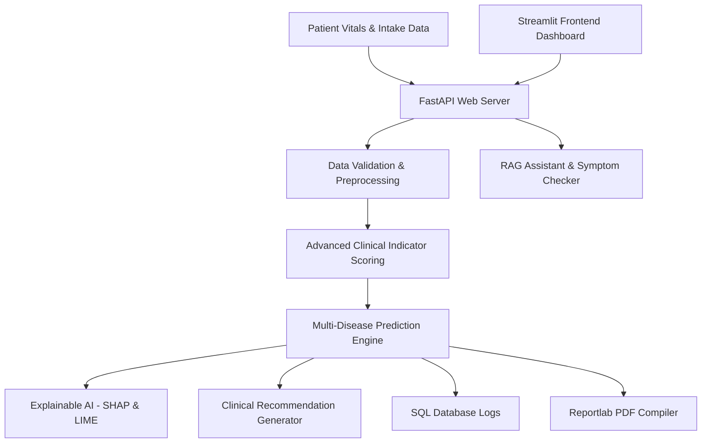

# AI-Powered Disease Prediction & Clinical Decision Support System (CDSS)

An end-to-end medical decision platform leveraging machine learning to predict risks across multiple diseases, explain outputs with SHAP/LIME explainability, host REST endpoints in FastAPI, serve analytics inside a Streamlit dashboard, compile PDF medical records, and query guidelines via a RAG medical chat assistant.



---

## 🛠️ Technology Stack & Dependencies

* **Backend**: FastAPI, Uvicorn, Pydantic, SQLAlchemy
* **Database**: PostgreSQL (Production) / SQLite (Development Auto-Fallback)
* **Machine Learning**: Scikit-Learn, XGBoost, SHAP, LIME
* **Explainability**: TreeExplainer, LinearExplainer, LimeTabularExplainer
* **Report Generation**: ReportLab PDF library
* **Frontend**: Streamlit, Matplotlib, Seaborn, Pandas, Numpy

---

## 📂 Project Structure

```
disease_prediction_platform/
├── datasets/                   # Raw CSV datasets (Heart, Diabetes, CKD, Liver, Hypertension)
├── data/                       # Imputed, validated, and processed datasets
├── preprocessing/              # Automated preprocessing pipeline (pipeline.py)
├── feature_engineering/        # Generation of advanced medical indicators (indicators.py)
├── training/                   # Model training, hyperparameter tuning, cross-validation (train_pipeline.py)
├── evaluation/                 # Metrics logging, confusion matrices, ROC/PR curve plots
├── explainability/             # SHAP and LIME explainer services (explainers.py)
├── backend/                    # FastAPI web server
│   ├── api.py                  # API endpoints and entrypoint
│   ├── services/               # Prediction engine, PDF generator, RAG chat service
│   ├── models/                 # ORM models (models.py)
│   └── schemas/                # Features and response schemas (patient.py)
├── frontend/                   # Streamlit dashboard
│   └── streamlit_app.py        # Interactive UI application
├── database/                   # SQLAlchemy schemas and database connections (connection.py)
├── reports/                    # Generated PDF medical risk assessment reports
├── tests/                      # Unit testing suite (test_backend.py)
├── models/                     # Saved model .joblib artifacts
├── docker/                     # Dockerfile and docker-compose files
├── requirements.txt            # System dependencies
└── README.md                   # Setup and operations guide
```

---

## 🚀 Setup & Execution Guide

### 1. Local Python Setup

1. **Install Python 3.12** and verify installation.
2. **Install dependencies**:
   ```bash
   pip install -r requirements.txt
   ```
3. **Download or build clinical datasets**:
   ```bash
   python datasets/dataset_builder.py
   ```
4. **Run data preprocessing**:
   ```bash
   python preprocessing/pipeline.py
   ```
5. **Train and evaluate ML models**:
   ```bash
   python -m training.train_pipeline
   ```
6. **Start FastAPI Backend**:
   ```bash
   uvicorn backend.api:app --host 127.0.0.1 --port 8000 --reload
   ```
7. **Start Streamlit Frontend Dashboard**:
   ```bash
   streamlit run frontend/streamlit_app.py
   ```

### 2. Docker Compose Deployment

Run the entire stack (FastAPI + Streamlit + PostgreSQL) in one command:
```bash
docker-compose up --build
```
* **FastAPI Backend**: `http://localhost:8000`
* **Streamlit UI**: `http://localhost:8501`
* **API Documentation (Swagger)**: `http://localhost:8000/docs`

---

## 💾 Database Schema Mapping

```sql
-- SQLAlchemy Model Definition Schema
CREATE TABLE patient_records (
    id SERIAL PRIMARY KEY,
    name VARCHAR(100) NOT NULL,
    age FLOAT NOT NULL,
    gender INT NOT NULL, -- 1=Male, 0=Female
    weight_kg FLOAT,
    height_cm FLOAT,
    bmi FLOAT,
    systolic_bp FLOAT,
    diastolic_bp FLOAT,
    heart_rate FLOAT,
    glucose FLOAT,
    creatinine FLOAT,
    cholesterol FLOAT,
    smoking_status INT,
    created_at TIMESTAMP
);

CREATE TABLE prediction_results (
    id SERIAL PRIMARY KEY,
    patient_id INT REFERENCES patient_records(id) ON DELETE CASCADE,
    prediction_date TIMESTAMP,
    disease_type VARCHAR(50) NOT NULL,
    probability FLOAT NOT NULL,
    risk_level VARCHAR(20) NOT NULL,
    confidence FLOAT,
    contributing_factors TEXT, -- JSON attributions list
    recommendation TEXT
);
```

---

## 📡 REST API Documentation

### POST `/predict/all`
Unified endpoint to evaluate risk across all 6 diseases from a single patient vitals payload:
* **Request Payload**:
  ```json
  {
    "name": "Alice Unified",
    "age": 55,
    "gender": 0,
    "weight_kg": 74,
    "height_cm": 165,
    "systolic_bp": 138,
    "diastolic_bp": 86,
    "glucose": 112,
    "hba1c": 5.9,
    "creatinine": 1.0,
    "cholesterol": 224,
    "chest_pain": 0,
    "fatigue": 1,
    "smoking_status": 0,
    "family_history": 1
  }
  ```
* **Response Details**:
  * BMI, BMI Category, BP Category, Composite Health Score.
  * Array of risk outcomes (Disease Name, Probability, Risk Level, Confidence, SHAP attributes, actions).

### GET `/patient/{patient_id}/pdf`
Downloads a styled PDF medical report containing patient vitals, predicted risks, SHAP contributing factors, and clinician guidelines.

### POST `/chat`
RAG query interface:
* **Payload**: `{"message": "What diet reduces heart disease risk?", "patient_id": 1}`
* **Response**: Retrieves matched guidelines and cross-checks them against the patient's vitals (e.g. glucose, creatinine levels).

---

## 🧪 Running Automated Tests

Run unit tests verifying API endpoints, predictions, RAG, and PDF generators:
```bash
python -m unittest tests.test_backend
```
